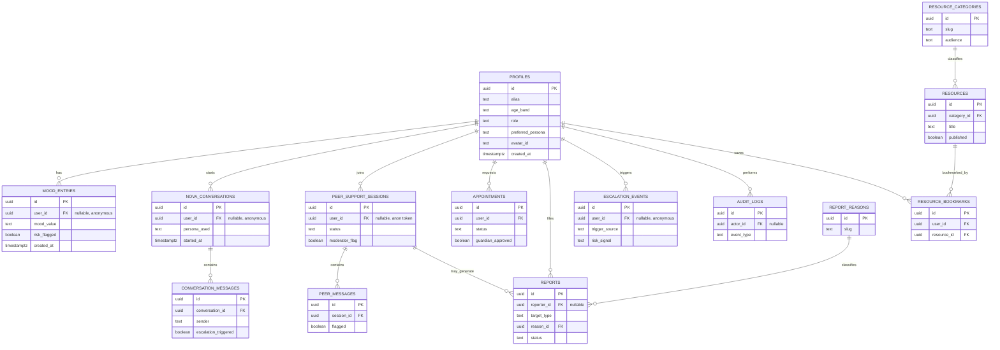

# Database-Schema.md — TeensHelpline.org

**Version:** 1.0
**Owner:** Database Architecture / Supabase Engineering
**Status:** Definitive reference for all Supabase/PostgreSQL decisions on this project
**Relationship to other docs:** The CRD, PRD, and TRD are not restated here. TRD §7 gave a high-level conceptual data model (`users`, `mood_entries`, `peer_sessions`, `counsellor_bookings`, `reports`, `resources`, `escalation_events`) — this document is the detailed, implementation-ready expansion of that model and is the source of truth where naming differs (e.g. TRD's conceptual `users` maps to `profiles` here, `peer_sessions` → `peer_support_sessions`, `counsellor_bookings` → `appointments`). No SQL is included anywhere in this document by design — it describes architecture and intent; actual migrations are written and applied via Supabase MCP per TRD's AI-Assisted Development Standards.

> **Precondition:** the Supabase project already exists and **Row Level Security was enabled at project creation**. Every table design below assumes RLS-on-by-default and is planned accordingly — there is no "add RLS later" step anywhere in this document.

---

## 1. Database Design Principles

| Principle | What it means here |
|---|---|
| **Privacy first** | No table stores a real name; `alias` is the only display identity. Anonymous users never get a persisted row anywhere. |
| **Security first** | RLS is the primary access-control mechanism, not an afterthought layered on top of app logic. |
| **RLS first** | Every table is designed with "who can read/write this row" as a first-class design question, not a post-hoc policy pass. |
| **Mobile-first performance** | Query patterns are optimized for small, paginated reads (dashboard cards, chat history pages) over large joins. |
| **Scalability** | Tables are structured so Phase 2 features (personas, languages, real counsellors) extend the schema rather than requiring a redesign. |
| **Maintainability** | Normalized where duplication would otherwise creep in (categories, reasons); denormalized only where the join cost isn't worth it at this scale. |
| **Normalized schema** | Lookup values (categories, report reasons) live in their own tables rather than as repeated free-text strings. |
| **Future extensibility** | New columns/tables can be added additively; nothing here requires breaking changes for known Phase 2 features (see §17). |
| **Minimal duplicated data** | Several tables suggested in early planning were deliberately *not* created — see §3.1 "Tables Deliberately Not Created" for the reasoning. |

---

## 2. Supabase Project Overview

| Aspect | Decision & Reasoning |
|---|---|
| **Why Supabase** | Managed Postgres + Auth + Storage + RLS in one project, with no separate API server to operate — matches TRD ADR-002 (Supabase as sole backend service) for an 8-day, 1-dev-lead build. |
| **PostgreSQL architecture** | Standard managed Postgres instance; all business tables live in the `public` schema; Supabase-managed auth data lives in `auth` schema and is never duplicated unnecessarily into `public`. |
| **Authentication** | Supabase Auth handles anonymous sessions and Google/Email persistent accounts (see §4); email confirmation intentionally off per TRD ADR-007. |
| **Storage** | Used only for static application assets in MVP (avatars, illustrations, resource images) — no user-uploaded files in MVP, per TRD's Storage Strategy (§13 below). |
| **Database** | Single Postgres database, single environment tier for the prototype; staging/production separation handled at the Supabase-project level, not schema level. |
| **Edge Functions** | Not required for MVP; candidates documented in §14 as Phase 2/production groundwork only. |
| **Realtime** | Selectively enabled — see §12. Not turned on broadly by default, to keep the RLS/Realtime interaction surface small and auditable. |
| **Row Level Security** | The primary security boundary for this entire system — see §7 for full policy planning. |
| **Future scalability** | Vertical scaling (compute tier) and read replicas are available without an application-layer rewrite, per TRD §30. |

---

## 3. Database Schema

Naming convention used throughout (detailed in §16): tables are `snake_case`, plural; primary keys are always `id` (`uuid`); foreign keys are `<singular_referenced_table>_id`; every table has `created_at`; tables that are ever mutated after creation also have `updated_at`.

### 3.1 Tables Deliberately Not Created (and why)

Several tables from initial planning were folded into existing tables or excluded outright, to honor "minimal duplicated data" and "do not create unnecessary tables":

| Considered table | Decision | Reasoning |
|---|---|---|
| `user_preferences` | **Merged into `profiles`** | MVP only needs a handful of scalar preferences (persona choice, theme). A separate key-value table is premature normalization for 2–3 fields; revisit only if preference count grows substantially (Phase 2). |
| `system_settings` | **Not created** | Coming Soon role gating is a simple code-level config map per TRD's Configuration Management section — a DB-backed settings table would be over-engineering for three toggles. |
| `content_pages` | **Not created** | Static pages (About, Safety, FAQ, policies) are Next.js static/MDX pages in the codebase, not database-driven CMS content, given the 8-day window. |
| `faq` | **Merged into `resources`** | An FAQ entry is structurally identical to a resource with `category = 'faq'` — a separate table would duplicate the same shape for no benefit. |
| `admins`, `moderators` | **Merged into `profiles.role`** | Role is already a column on `profiles` (see §4); separate tables per role would fragment a single concept RLS already keys off cleanly. |
| `teacher_resources`, `parent_resources` | **Merged into `resources`** | Modeled as an `audience` classification on the existing `resources` table rather than parallel tables with identical shape. |
| `activity_logs` | **Merged into `audit_logs`** | Both are "something happened, log it" tables; one unified append-only log with an `event_type` column avoids maintaining two audit trails. |

### 3.2 `profiles`

Extends `auth.users` with the application's public-facing profile data. One row per **persistent** account only — anonymous sessions never get a `profiles` row (see §4).

| Column | Type | Nullable | Default | Notes |
|---|---|---|---|---|
| `id` | uuid (PK) | No | — | Same value as `auth.users.id` (1:1 extension, not a separate identity) |
| `alias` | text | No | — | The only display identity; never a real name |
| `age_band` | text | No | — | Self-declared bracket (e.g. `13-15`, `16-19`), never exact birthdate |
| `role` | text (enum-like) | No | `'teen'` | One of: `teen`, `parent`, `counsellor`, `teacher_educator`, `moderator`, `admin` |
| `preferred_persona` | text | Yes | `'big_brother'` | One of the four Nova personas (Persona.md §1); null defaults to Big Brother |
| `avatar_id` | text | Yes | null | References a fixed illustrated set id, not a Storage file path (no uploads in MVP) |
| `school_verified` | boolean | Yes | `false` | Reserved for Teacher/Educator role verification, Phase 2 |
| `created_at` | timestamptz | No | now() | |
| `updated_at` | timestamptz | No | now() | Updated via trigger, §9 |

**Relationships:** 1:many → `mood_entries`, `nova_conversations`, `peer_support_sessions`, `appointments`, `reports`, `escalation_events`, `resource_bookmarks`.

### 3.3 `mood_entries`

| Column | Type | Nullable | Default | Notes |
|---|---|---|---|---|
| `id` | uuid (PK) | No | gen_random_uuid() | |
| `user_id` | uuid (FK → profiles.id) | **Yes** | null | Null for anonymous sessions — never persisted for anonymous in practice (app-layer enforces this; see §8 Retention) |
| `mood_value` | text | No | — | One of the 5 MVP mood options (Happy, Okay, Sad, Overwhelmed, Anxious) |
| `note` | text | Yes | null | Optional free-text; sanitized before storage per TRD §16 |
| `risk_flagged` | boolean | No | `false` | Set by the app-layer Escalation Layer check (TRD §17), not derived in the database |
| `created_at` | timestamptz | No | now() | |

**Constraint:** one entry per session in MVP (enforced at the application layer, not a DB uniqueness constraint, since "session" isn't a DB concept for anonymous users).

### 3.4 `nova_conversations`

Container for a Nova chat session — one row per conversation, not per message.

| Column | Type | Nullable | Default | Notes |
|---|---|---|---|---|
| `id` | uuid (PK) | No | gen_random_uuid() | |
| `user_id` | uuid (FK → profiles.id) | **Yes** | null | Null for anonymous sessions; anonymous conversations are never persisted in practice — see §8 |
| `persona_used` | text | No | — | Snapshot of which persona was active; a persona switch mid-conversation does not create a new row |
| `started_at` | timestamptz | No | now() | |
| `ended_at` | timestamptz | Yes | null | Set when the session is explicitly closed or times out |

**Relationships:** 1:many → `conversation_messages`.

### 3.5 `conversation_messages`

| Column | Type | Nullable | Default | Notes |
|---|---|---|---|---|
| `id` | uuid (PK) | No | gen_random_uuid() | |
| `conversation_id` | uuid (FK → nova_conversations.id) | No | — | |
| `sender` | text | No | — | `'user'` or `'nova'` |
| `content` | text | No | — | Sanitized before storage; never logged to general application logs (TRD §15) |
| `escalation_triggered` | boolean | No | `false` | True if this specific message caused an escalation event |
| `created_at` | timestamptz | No | now() | |

**Note:** for anonymous sessions this table is never written to at all — the app keeps anonymous conversation state in-memory only (Zustand `novaStore`, per TRD §20), consistent with PRD's Chat Memory table.

### 3.6 `peer_support_sessions`

| Column | Type | Nullable | Default | Notes |
|---|---|---|---|---|
| `id` | uuid (PK) | No | gen_random_uuid() | |
| `user_id` | uuid (FK → profiles.id) | **Yes** | null | Nullable for an anonymous token-based participant |
| `anon_token` | text | Yes | null | Populated only when `user_id` is null, to allow session continuity without identity |
| `status` | text | No | `'active'` | `active`, `closed`, `flagged` |
| `moderator_flag` | boolean | No | `false` | Set true once a report is filed or moderation intervenes |
| `created_at` | timestamptz | No | now() | |
| `updated_at` | timestamptz | No | now() | |

**Constraint:** exactly one of `user_id` / `anon_token` must be populated (application-enforced; described here rather than as a written CHECK constraint since no SQL is included in this document, but this is the intended rule for whoever writes the migration).

### 3.7 `peer_messages`

| Column | Type | Nullable | Default | Notes |
|---|---|---|---|---|
| `id` | uuid (PK) | No | gen_random_uuid() | |
| `session_id` | uuid (FK → peer_support_sessions.id) | No | — | |
| `sender_ref` | text | No | — | Alias or anon token of the sender — never a real identity |
| `content` | text | No | — | Sanitized before storage; passed through the moderation hook before persistence (TRD §6) |
| `flagged` | boolean | No | `false` | Set true if this message triggered a report or moderation review |
| `created_at` | timestamptz | No | now() | |

### 3.8 `appointments` *(prototype — simulated)*

Maps to TRD's conceptual `counsellor_bookings`. Renamed here to reflect that this table represents the general concept of a scheduled human-support session, which is the more durable name as the feature evolves from simulated to real.

| Column | Type | Nullable | Default | Notes |
|---|---|---|---|---|
| `id` | uuid (PK) | No | gen_random_uuid() | |
| `user_id` | uuid (FK → profiles.id) | No | — | Booking always requires a persistent account (per PRD) |
| `simulated_slot` | text | No | — | A display string standing in for a real availability system |
| `status` | text | No | `'requested'` | `requested`, `confirmed`, `unavailable`, `cancelled` — all simulated state transitions |
| `guardian_approved` | boolean | No | `false` | Represented as policy text/flag only, not a real legal workflow, per CRD §10 |
| `created_at` | timestamptz | No | now() | |
| `updated_at` | timestamptz | No | now() | |

> **Schema comment requirement (per TRD §8):** this table's migration must carry an explicit `-- PROTOTYPE: simulated, not connected to a real backend` comment so future engineers don't mistake it for production-ready.

### 3.9 `resource_categories`

| Column | Type | Nullable | Default | Notes |
|---|---|---|---|---|
| `id` | uuid (PK) | No | gen_random_uuid() | |
| `slug` | text | No | — | Unique, URL-safe (e.g. `academic-stress`, `bullying`, `faq`) |
| `label` | text | No | — | Human-readable display name |
| `audience` | text | No | `'teen'` | `teen`, `parent`, `teacher_educator` — this is what replaces the separate `teacher_resources`/`parent_resources` tables |
| `created_at` | timestamptz | No | now() | |

### 3.10 `resources`

| Column | Type | Nullable | Default | Notes |
|---|---|---|---|---|
| `id` | uuid (PK) | No | gen_random_uuid() | |
| `category_id` | uuid (FK → resource_categories.id) | No | — | |
| `title` | text | No | — | |
| `content` | text | No | — | Markdown/rich text body |
| `content_warning_flag` | boolean | No | `false` | Per CRD content-governance requirements |
| `published` | boolean | No | `false` | Draft/publish workflow for content review sign-off (TRD §6 Content Management) |
| `created_at` | timestamptz | No | now() | |
| `updated_at` | timestamptz | No | now() | |

### 3.11 `resource_bookmarks`

Many-to-many join table between `profiles` and `resources` (logged-in users only, per PRD's "saved resources" feature).

| Column | Type | Nullable | Default | Notes |
|---|---|---|---|---|
| `id` | uuid (PK) | No | gen_random_uuid() | |
| `user_id` | uuid (FK → profiles.id) | No | — | |
| `resource_id` | uuid (FK → resources.id) | No | — | |
| `created_at` | timestamptz | No | now() | |

**Constraint:** unique on (`user_id`, `resource_id`) — a resource can only be bookmarked once per user.

### 3.12 `report_reasons`

| Column | Type | Nullable | Default | Notes |
|---|---|---|---|---|
| `id` | uuid (PK) | No | gen_random_uuid() | |
| `slug` | text | No | — | Unique (e.g. `inappropriate_content`, `unsafe_advice`, `harassment`) |
| `label` | text | No | — | Human-readable, shown in the report UI |

### 3.13 `reports`

| Column | Type | Nullable | Default | Notes |
|---|---|---|---|---|
| `id` | uuid (PK) | No | gen_random_uuid() | |
| `reporter_id` | uuid (FK → profiles.id) | **Yes** | null | Nullable to allow anonymous peer-support participants to file reports |
| `target_type` | text | No | — | `peer_message`, `peer_session`, `resource` — polymorphic reference |
| `target_id` | uuid | No | — | Not a hard FK (polymorphic across target types); resolved at the application layer |
| `reason_id` | uuid (FK → report_reasons.id) | No | — | |
| `details` | text | Yes | null | Optional free-text elaboration, sanitized before storage |
| `status` | text | No | `'open'` | `open`, `reviewed`, `resolved` |
| `created_at` | timestamptz | No | now() | Insert-only from the application layer — no update/delete path in MVP (TRD §8) |

### 3.14 `escalation_events`

| Column | Type | Nullable | Default | Notes |
|---|---|---|---|---|
| `id` | uuid (PK) | No | gen_random_uuid() | |
| `user_id` | uuid (FK → profiles.id) | **Yes** | null | Null for anonymous escalations — logged without any identifying data |
| `trigger_source` | text | No | — | `nova`, `mood_entry`, `peer_chat`, `content_page` |
| `risk_signal` | text | No | — | Category of the detected signal (e.g. `self_harm_language`, `suicidal_ideation`, `substance_use`) — never the raw triggering text itself |
| `created_at` | timestamptz | No | now() | Insert-only; this is the single most important audit trail in the system (TRD §15) |

**Explicit design note:** this table never stores the raw message content that triggered escalation — only a category label. This keeps the most sensitive table in the schema free of the actual crisis content, while still preserving a complete audit trail of *when and how often* escalation fired.

### 3.15 `audit_logs`

Unified log covering both content-management activity and general administrative activity (replaces the separately-considered `activity_logs`).

| Column | Type | Nullable | Default | Notes |
|---|---|---|---|---|
| `id` | uuid (PK) | No | gen_random_uuid() | |
| `actor_id` | uuid (FK → profiles.id) | **Yes** | null | Null for system-initiated events |
| `event_type` | text | No | — | e.g. `resource_published`, `report_reviewed`, `role_changed` |
| `target_type` | text | Yes | null | Polymorphic, mirrors `reports.target_type` pattern |
| `target_id` | uuid | Yes | null | |
| `metadata` | jsonb | Yes | null | Small structured detail only — never chat content or mood notes (TRD §15) |
| `created_at` | timestamptz | No | now() | Insert-only |

### 3.16 `contact_messages`

| Column | Type | Nullable | Default | Notes |
|---|---|---|---|---|
| `id` | uuid (PK) | No | gen_random_uuid() | |
| `name` | text | Yes | null | Optional — contact form doesn't require identity |
| `email` | text | Yes | null | Optional |
| `message` | text | No | — | Sanitized before storage |
| `status` | text | No | `'new'` | `new`, `handled` |
| `created_at` | timestamptz | No | now() | |

### 3.17 Phase 2 — Scaffolded Tables Only

These are designed now (so the schema doesn't need breaking changes later) but are **not built or exposed in the MVP**:

| Table | Purpose | Why deferred |
|---|---|---|
| `notifications` | In-app notifications (e.g. booking status change, report reviewed) | No dashboard consumes notifications yet in MVP; premature to build the producer side alone |
| `feedback` | Lightweight thumbs-up/down on Nova responses or general product feedback | Not a Must-Have per PRD MoSCoW; low cost to add later without migration conflicts |
| `analytics_events` | Aggregate, privacy-respecting usage counters only (e.g. `mood_checkin_completed`, `study_hub_article_viewed`) — **never** raw chat content, never per-user behavioral tracking beyond a count | PRD/TRD explicitly scope analytics to Phase 2, aggregate-only; table shape is fixed now so future analytics work doesn't retrofit privacy constraints after the fact |

---

## 4. Authentication Architecture

| Concept | Design |
|---|---|
| **`auth.users` relationship** | Supabase-managed; `profiles.id` is a 1:1 extension of `auth.users.id`. No PII beyond what Supabase Auth itself requires (email, if provided) lives in `auth.users`; everything display-facing lives in `profiles`. |
| **Guest** | No `auth.users` row at all — a guest is any visitor who hasn't chosen an entry method yet. |
| **Anonymous session** | Supabase Auth's anonymous sign-in creates an `auth.users` row with `is_anonymous = true` and **no corresponding `profiles` row** — anonymous users are recognized by their session JWT alone; app logic checks `is_anonymous` rather than looking up a profile. |
| **Teen** | Either anonymous (as above) or persistent — a `profiles` row with `role = 'teen'`. |
| **Parent** | Always persistent (Google/Email) — `profiles.role = 'parent'`, per PRD (Parent dashboard requires an account). |
| **Future roles (Counsellor, Teacher/Educator, Moderator, Administrator)** | `role` column already supports these values today; RLS policies for these roles are written now (§7) even though no onboarding flow assigns them yet — role assignment for these will be a manual/admin-driven update to `profiles.role` until a real onboarding flow exists. |
| **Role assignment** | MVP: default `'teen'` on signup, changeable to `'parent'` during Role Selection (PRD). Coming Soon roles: assigned manually by an admin (no self-service signup path in MVP). |
| **Permissions** | Enforced entirely through RLS policies keyed on `auth.uid()` and `profiles.role` — see §7. |
| **Login methods** | Anonymous (session-only), Google OAuth, Email/password (confirmation disabled per TRD ADR-007). |
| **Account upgrade (anonymous → persistent)** | Supabase Auth's identity-linking flow converts an anonymous session into a persistent Google/Email account without losing the session's `auth.users.id` — but since anonymous sessions never wrote to `profiles`, `mood_entries`, or `nova_conversations` in the first place, there is no historical data to "carry over"; the upgrade simply starts persistence going forward. |
| **Future OAuth expansion** | Provider abstraction is Supabase Auth's own (not a custom layer) — adding a new OAuth provider (Apple, etc.) is a Supabase Auth dashboard configuration change, not a schema change. |

---

## 5. Entity Relationship Diagram

### Relationship Explanations

| Relationship | Type | Cascade / Delete Behavior |
|---|---|---|
| `profiles` → `mood_entries` | One-to-many | On profile deletion: **anonymize**, don't cascade-delete (see §10 Soft Delete) — set `user_id` to null rather than removing the row, preserving any aggregate value without retaining identity |
| `profiles` → `nova_conversations` → `conversation_messages` | One-to-many, chained | On profile deletion: anonymize `nova_conversations.user_id`; `conversation_messages` has no direct `user_id` so it's unaffected by profile deletion, but is deleted if its parent conversation is explicitly purged (see §11 Retention) |
| `profiles` → `peer_support_sessions` → `peer_messages` | One-to-many, chained | On profile deletion: anonymize `user_id`; messages remain for moderation-history integrity |
| `profiles` → `appointments` | One-to-many | Hard delete on profile deletion is acceptable — this is simulated data with no independent audit value |
| `profiles` → `reports` (as reporter) | One-to-many | **Never cascade-delete** — anonymize `reporter_id` only; reports are an append-only safety record (TRD §8) |
| `profiles` → `escalation_events` | One-to-many | **Never cascade-delete** — anonymize `user_id` only; this is the one table that must survive any user-deletion event intact except for the identity link |
| `resource_categories` → `resources` | One-to-many | Restrict delete — a category with existing resources cannot be deleted until resources are reassigned |
| `resources` ↔ `profiles` via `resource_bookmarks` | Many-to-many | Cascade delete the bookmark row if either the profile or the resource is deleted — the bookmark has no independent meaning |
| `report_reasons` → `reports` | One-to-many | Restrict delete — a reason in use cannot be deleted, only deprecated (unpublished from the UI list) |

---

## 6. Row Level Security

### 6.1 Why RLS Matters Here

This platform's data includes mood entries, chat history, and peer-support conversations from minors — the single highest-consequence category of data this system touches. RLS is treated as the **primary** access-control layer, not a backstop behind application logic: even if a Route Handler had a bug, a misconfigured client-side query should still be structurally incapable of reading another teen's data, because the database itself refuses the query.

### 6.2 Security Philosophy & Design Principles

- **Deny by default:** every table starts with RLS enabled and zero policies — access is explicitly granted, never implicitly available.
- **`auth.uid()` is the only identity source** for ownership checks — never a client-supplied user id in a request body.
- **Anonymous data has no owner to check** — tables that anonymous users write to (`mood_entries`, `nova_conversations` in theory, `peer_support_sessions`) use session-scoped logic (null `user_id` + short-lived token) rather than `auth.uid()`, since anonymous sessions are still real Supabase Auth sessions with their own `auth.uid()` that simply never gets written to `profiles`.
- **Parents never get a query path to a specific teen's data** — this is enforced as an *absence* of policy, not a denied policy; there is no RLS rule anywhere that lets `role = 'parent'` read another user's `mood_entries`, `nova_conversations`, or `peer_support_sessions` rows, by design.
- **Service-role key never touches client-reachable code** — RLS is irrelevant if the all-powerful service key leaks into a client bundle or an insecure server path; this is a deployment discipline (TRD §16), not a policy design question, but it's the precondition that makes all RLS planning below meaningful.

### 6.3 Policy Planning by Table

Legend: ✅ full access to own/relevant rows · 🚫 no access · 👁 read-only · — not applicable (role has no relationship to this table)

| Table | Guest | Anonymous | Teen | Parent | Moderator | Admin | Counsellor *(future)* | Teacher/Educator *(future)* |
|---|---|---|---|---|---|---|---|---|
| `profiles` | 🚫 | 🚫 (no row) | ✅ own row only | ✅ own row only | 👁 (moderation context only) | ✅ all rows | 👁 own row | 👁 own row |
| `mood_entries` | 🚫 | ✅ INSERT own session, no SELECT persisted (not written) | ✅ own rows only (SELECT/INSERT) | 🚫 | 🚫 | 👁 aggregate/audit only, no individual browsing | 🚫 | 🚫 |
| `nova_conversations` / `conversation_messages` | 🚫 | ✅ session-only, not persisted | ✅ own rows only | 🚫 | 🚫 | 🚫 (never — content is off-limits even to admins, per PRD's privacy stance) | 🚫 | 🚫 |
| `peer_support_sessions` / `peer_messages` | 🚫 | ✅ own session via anon token | ✅ own sessions only | 🚫 | ✅ all, for moderation | ✅ all | 🚫 | 🚫 |
| `appointments` | 🚫 | 🚫 | ✅ own rows (INSERT/SELECT) | ✅ approve own teen's request *(Phase 2 real linkage; no query path in MVP since no real parent-teen link exists yet)* | 🚫 | 👁 all | ✅ manage assigned bookings *(future)* | 🚫 |
| `resource_categories` / `resources` (published) | 👁 | 👁 | 👁 | 👁 | 👁 | ✅ full CRUD | 👁 | 👁 |
| `resources` (unpublished/draft) | 🚫 | 🚫 | 🚫 | 🚫 | 👁 | ✅ full CRUD | 🚫 | 🚫 |
| `resource_bookmarks` | 🚫 | 🚫 (no persistence) | ✅ own rows only | 🚫 | 🚫 | 🚫 | 🚫 | 🚫 |
| `report_reasons` | 👁 | 👁 | 👁 | 👁 | 👁 | ✅ full CRUD | — | — |
| `reports` | 🚫 | ✅ INSERT only (file a report), no SELECT | ✅ INSERT own; SELECT own submitted reports only | 🚫 | ✅ all (review/update status) | ✅ all | 🚫 | 🚫 |
| `escalation_events` | 🚫 | 🚫 (system-inserted only, no direct user access) | 🚫 (system-inserted only) | 🚫 | ✅ SELECT all (safety monitoring) | ✅ full | 🚫 | 🚫 *(explicitly excluded — Teacher/Educator must never see escalation data, per PRD)* |
| `audit_logs` | 🚫 | 🚫 | 🚫 | 🚫 | 👁 relevant entries | ✅ full | 🚫 | 🚫 |
| `contact_messages` | ✅ INSERT only | ✅ INSERT only | ✅ INSERT only | ✅ INSERT only | 🚫 | ✅ full | 🚫 | 🚫 |

> **Note on inserts vs. selects:** several rows above split INSERT and SELECT permissions deliberately (e.g. anonymous users can *file* a report but not *read back* the reports table) — this is a common and important RLS pattern: the ability to submit something is not the same as the ability to query the table it lands in.

---

## 7. Indexing Strategy

| Index | Table(s) | Reasoning |
|---|---|---|
| `user_id` (btree) | `mood_entries`, `nova_conversations`, `peer_support_sessions`, `appointments`, `resource_bookmarks` | Every dashboard/history query filters "rows belonging to this user" first — this is the single most common query shape in the system |
| `created_at` (btree, descending) | `mood_entries`, `conversation_messages`, `peer_messages`, `escalation_events`, `audit_logs` | Supports cursor-based pagination and "most recent first" ordering without a full table scan |
| Composite `(conversation_id, created_at)` | `conversation_messages` | Chat history is always fetched "messages for this conversation, in order" — a composite index avoids a separate sort step |
| Composite `(session_id, created_at)` | `peer_messages` | Same pattern as above for peer chat |
| `slug` (unique) | `resource_categories`, `report_reasons` | Lookup by human-readable identifier, and enforces no duplicate categories/reasons |
| `category_id` | `resources` | Study Hub browsing is category-first navigation |
| `published` (partial index where `published = true`) | `resources` | The public-facing query path only ever wants published content; a partial index keeps it small and fast |
| `status` | `reports`, `appointments` | Moderator/admin queues filter by status constantly (`open` reports, `requested` bookings) |
| `role` | `profiles` | RLS policy checks and admin role-management views both filter on this column |

**Performance consideration:** at prototype scale (8-day build, low real traffic), most of these indexes are "correct architecture" rather than urgently necessary — but they're specified now so the migration is right the first time rather than requiring an index-adding pass discovered under later load.

---

## 8. Database Functions *(described, not written in SQL)*

| Function | Purpose |
|---|---|
| `set_updated_at()` | Generic trigger-target function that stamps `updated_at = now()` on any row update; reused across every table that has an `updated_at` column rather than duplicated per table |
| `log_escalation_event(source, risk_signal, user_id)` | Called from application code (not from a database trigger reacting to message content — the risk-detection logic itself lives in the app's Escalation Layer per TRD §17) to insert a row into `escalation_events` consistently |
| `check_user_role(required_role)` | Helper used inside RLS policy definitions to keep role-comparison logic in one place rather than repeating `profiles.role = 'x'` inline across dozens of policies |
| `create_notification(user_id, type, payload)` *(Phase 2)* | Inserts into the scaffolded `notifications` table once that feature is built |
| `get_conversation_context(conversation_id, message_limit)` | Returns a bounded window of recent messages for a conversation — backs the Context Builder's "never a full chat history dump" rule (TRD §17) at the data layer |
| `anonymize_profile(user_id)` | Implements the soft-delete/anonymization path described in §10 — nulls out `alias` and identity-bearing fields while leaving dependent rows (with their `user_id` also nulled per §5's cascade table) intact |

---

## 9. Triggers *(described, not written in SQL)*

| Trigger | Fires on | Action |
|---|---|---|
| `trg_set_updated_at` | BEFORE UPDATE on any table with `updated_at` (`profiles`, `resources`, `peer_support_sessions`, `appointments`) | Calls `set_updated_at()` |
| `trg_audit_resource_change` | AFTER INSERT/UPDATE on `resources` | Writes an `audit_logs` row (`event_type = 'resource_published'` or `'resource_updated'`) |
| `trg_audit_report_status_change` | AFTER UPDATE on `reports` (when `status` changes) | Writes an `audit_logs` row (`event_type = 'report_reviewed'` or `'report_resolved'`) |
| `trg_notify_on_appointment_status` *(Phase 2)* | AFTER UPDATE on `appointments` | Once `notifications` exists, inserts a notification row on status change |

**Explicitly not a trigger:** escalation logging is **not** implemented as a database trigger inspecting `conversation_messages.content` for risk patterns. Pattern-matching is application logic (TRD §17's Escalation Layer runs before the AI call, in code) — the database only ever receives an already-classified `log_escalation_event()` call. Keeping risk detection out of the database avoids duplicating safety-critical logic in two places where it could drift out of sync.

---

## 10. Supabase Storage

| Bucket | Purpose | Public/Private | Allowed File Types | Access Rules | Max Size |
|---|---|---|---|---|---|
| `avatars` | Fixed illustrated avatar set (admin-uploaded, not user-uploaded) | Public (read) | `.png`, `.svg` | Write: admin only. Read: public. No user upload path exists in MVP (§13, TRD Storage Strategy) | 500 KB/file |
| `illustrations` | Onboarding/Nova Lottie JSON files and static illustrations | Public (read) | `.json` (Lottie), `.png`, `.svg` | Write: admin/dev only, via deploy process. Read: public | 2 MB/file |
| `resources` | Images embedded in Study Hub / resource content | Public (read) | `.png`, `.jpg`, `.webp` | Write: admin/content-manager role only. Read: public | 2 MB/file |
| `documents` *(Phase 2 scaffold)* | Reserved for future simulated-counsellor materials or downloadable Teacher/Educator resources (per PRD's downloadable-resources requirement) | Private | `.pdf` | Not active in MVP — no upload path wired up; bucket created empty as groundwork | 10 MB/file |

**No bucket accepts direct end-user uploads in MVP** — this mirrors the PRD's resolved open question (fixed avatar set, no custom uploads) and TRD's Storage Strategy, and removes an entire class of moderation/validation work the 8-day window has no room for.

---

## 11. Realtime

| Table | Realtime enabled? | Reasoning |
|---|---|---|
| `conversation_messages` | **No** in MVP | Nova's reply is a request/response HTTP call (TRD §17 sequence diagram), not a multi-party live channel — Realtime would add complexity with no UX benefit here |
| `peer_messages` | **Yes** | Peer support is genuinely multi-party and benefits from live message delivery without polling |
| `peer_support_sessions` (status/`moderator_flag`) | **Yes** | So a flagged/closed session updates the UI immediately for both participants and moderators |
| `notifications` *(Phase 2)* | **Yes, once built** | In-app notifications are a natural Realtime use case |
| Everything else | **No** | Enabling Realtime broadly widens the audited surface area for no proportional benefit at this scale — each Realtime-enabled table is a deliberate choice, not a default |

---

## 12. Edge Functions *(future/production groundwork — not required for the 8-day MVP)*

| Candidate Function | Purpose | Why not MVP |
|---|---|---|
| Scheduled cleanup | Purge stale/expired anonymous-adjacent rows (e.g. abandoned `peer_support_sessions` with no activity) | No real accumulation risk at prototype scale/traffic |
| Escalation notification dispatch | Real human follow-up (e.g. paging a moderator) when `escalation_events` spikes | Requires a real on-call/human-follow-up system that doesn't exist yet — CRD marks this as simulated |
| Email sending | Booking confirmations, contact-form acknowledgments | No real email deliverability set up yet (TRD ADR-007) |
| Analytics aggregation | Roll up `analytics_events` into daily aggregates | Analytics itself is Phase 2 |
| Rate limiting | Enforce `/api/chat` and auth rate limits | Already handled at the Next.js application layer (TRD §16) — a DB-level Edge Function would be redundant, not complementary, unless the app layer proves insufficient under real load |

---

## 13. Database Security

| Concern | Approach |
|---|---|
| **Least privilege** | Only the server-side service-role key can bypass RLS, and it is never present in any client-reachable code path (TRD §16) |
| **RLS as primary defense** | See §6 — every table, no exceptions, no "trusted" tables that skip policy design |
| **Sensitive data minimization** | No real names, no exact birthdates, no raw crisis-triggering text stored in `escalation_events` (§3.14) |
| **PII scope** | Effectively limited to `alias`, `age_band`, and (if provided) email in `auth.users` — nothing else in this schema is identity-revealing on its own |
| **Encryption** | At-rest encryption is handled by Supabase's managed Postgres; no additional application-level encryption is added in MVP, since it would add complexity without a corresponding real threat at this data sensitivity/scale for a prototype |
| **Secrets/API keys** | Never stored in any table — all keys live in Vercel environment variables (TRD §21), never in `system_settings` or any DB row |
| **Audit logs** | `audit_logs` and `escalation_events` are both insert-only from the application layer, giving a tamper-evident-by-convention trail (true tamper-proofing via DB-level REVOKE on UPDATE/DELETE is a reasonable production hardening step, noted here as a future improvement rather than an MVP requirement) |

---

## 14. Soft Delete Strategy

| Concept | Design |
|---|---|
| **Soft delete (default for `profiles`)** | Deleting an account **anonymizes** rather than hard-deletes: `alias`, `avatar_id`, and any other identity-bearing fields are nulled/replaced via `anonymize_profile()` (§8); the row itself may remain or be removed depending on whether any dependent table still needs a valid FK target — either way, no identity survives. |
| **Hard delete** | Used only for tables with no independent audit value once the parent is gone — e.g. `resource_bookmarks` (§5's cascade table), `appointments` on request. |
| **Never-delete tables** | `escalation_events` and `reports` are never hard-deleted, even on account deletion — only the `user_id`/`reporter_id` link is anonymized. This preserves the safety audit trail's completeness, which matters more here than in a typical consumer app. |
| **GDPR-style deletion requests** | A user-initiated "delete my data" request (PRD's Settings module) triggers: (1) anonymize `profiles`, (2) anonymize `user_id` on all dependent rows per §5, (3) hard-delete anything with no audit value (bookmarks, simulated appointments), (4) leave `escalation_events`/`reports` intact but unlinkable to the person. This satisfies the spirit of a deletion request (no recoverable identity) without destroying safety-relevant history. |

---

## 15. Data Retention

| Data category | Retention approach |
|---|---|
| **Mood history** | Anonymous: never persisted (in-memory only). Logged-in: retained indefinitely in MVP; a user-facing deletion option exists via Settings (§14) |
| **Nova conversations** | Anonymous: never persisted. Logged-in: retained for the "saved conversations" feature (PRD Chat Memory); deletable via Settings |
| **Reports** | Retained indefinitely — append-only safety record; anonymized, not deleted, on account deletion |
| **Peer sessions** | Retained for a moderation-relevant window; no automatic purge in MVP given prototype scale, revisit for production with a defined retention window (e.g. 90 days post-session) |
| **Analytics** *(Phase 2)* | Aggregate-only by design (§3.17) — there is no raw per-user behavioral log to "retain" in the first place |
| **Audit logs** | Retained indefinitely — this is the administrative equivalent of the escalation audit trail |
| **Deleted accounts** | Anonymized permanently per §14; no "undelete" path in MVP |

---

## 16. Backup and Recovery

| Aspect | Approach |
|---|---|
| **Supabase backups** | Rely on Supabase's built-in automated daily backups for the project tier in use; no custom backup tooling built for an 8-day prototype |
| **Recovery strategy** | Point-in-time recovery (if available on the project's tier) is the primary recovery path for accidental data loss; documented as a known constraint if the tier doesn't include it (TRD §32-style constraint) |
| **Migration safety** | All schema changes go through Supabase MCP against a preview/staging project first (TRD's Development Standards), never applied directly to production via the SQL console |
| **Rollback planning** | Every migration is written to be reversible where structurally possible (additive changes preferred over destructive ones); a migration that drops or renames a column is treated as a higher-risk change requiring explicit review, not routine practice |

---

## 17. Database Migrations

| Aspect | Approach |
|---|---|
| **Versioning** | Sequential, timestamp-prefixed migration files (Supabase's default convention), applied in order |
| **Naming** | `<timestamp>_<verb>_<subject>.sql` (e.g. `20250101120000_create_profiles_table.sql`) — descriptive enough that the migration history reads as a changelog |
| **Development workflow** | Migrations authored and tested via Supabase MCP against a local/preview Supabase instance before touching staging |
| **Production workflow** | Migrations promoted staging → production only after the corresponding feature branch has merged to `develop` and passed CI (TRD §22–23); no ad hoc production schema edits, ever |

---

## 18. Performance

| Concern | Approach |
|---|---|
| **Indexes** | See §7 — matched to actual query patterns, not speculative |
| **Query optimization** | Dashboard/history queries always filter by `user_id` and paginate by `created_at`; no unbounded "select all rows" queries anywhere in the application |
| **Pagination** | Cursor-based (using `created_at` + `id` as a tiebreaker) rather than offset-based, so performance doesn't degrade as a conversation or history grows |
| **Filtering** | Category/status filters use indexed columns (§7) |
| **Searching** | Basic `ILIKE`/keyword search across `resources.title`/`content` is sufficient for MVP scope; full-text search (`pg_trgm`/`tsvector`) is a reasonable Phase 2 addition if the Study Hub content library grows significantly |
| **Caching** | Handled at the application layer (TRD §18 — ISR for static resource content), not at the database layer, for MVP |
| **Connection pooling** | Uses Supabase's built-in connection pooler (transaction mode) — no custom pooling infrastructure needed |
| **Scalability** | Vertical scaling (compute tier) and read replicas remain available without an application-layer rewrite, per TRD §30 |

---

## 19. Analytics Database Design *(Phase 2)*

The `analytics_events` table (§3.17) is scoped narrowly and deliberately:

| Supports | Explicitly does NOT support |
|---|---|
| Aggregate mood-distribution trends (counts per mood value per period) | Storing which specific user reported which specific mood alongside identity, beyond what `mood_entries` already does for the user's own history |
| Resource popularity (view/bookmark counts per resource) | Per-user browsing history beyond their own `resource_bookmarks` |
| Nova usage volume (conversation counts, persona-selection distribution) | Any conversation content — `analytics_events` never references `conversation_messages` content, only counts |
| Daily active user counts (aggregate, not identified) | Individual session tracking beyond what's operationally necessary for the feature itself |
| Feature adoption (e.g. % of sessions that used Study Hub vs. Nova) | Third-party analytics SDK integration of any kind (TRD §25) |

This table is designed to make it structurally awkward to accidentally collect sensitive data through analytics later — it has no column that could hold conversation content, by design, not just by policy.

---

## 20. Future Scalability

| Future feature | Schema readiness |
|---|---|
| **Multiple AI personas** | Already supported — `profiles.preferred_persona` and `nova_conversations.persona_used` exist today (Persona.md's four personas are a data value, not a schema change) |
| **Multiple languages** | `resources` and `resource_categories` can add a `locale` column additively without breaking existing rows (default to `'en'`) |
| **Schools** | `resource_categories.audience = 'teacher_educator'` and the `teacher_educator` role already exist; a future `schools` table (school name, verification status) would attach to `profiles` via a nullable FK without disrupting existing data |
| **Real counsellors** | `appointments` evolves from `simulated_slot` (text) to a real `counsellor_availability` table + real FK, without renaming or restructuring the existing table — the simulated version is a strict subset of the real one |
| **Communities** | `peer_support_sessions` could extend to a group-session model by adding a `session_type` column (`1:1` vs `group`) and a join table for multiple participants, rather than a redesign |
| **Video calls** | `appointments` can add a `session_link` column additively when real scheduling exists |
| **Payments** *(if ever added)* | Deliberately out of scope architecturally — would require new, isolated billing tables (never touching `profiles` directly) and is not a foreseeable near-term need given the platform's free-service positioning (CRD) |
| **Native mobile apps** | Nothing in this schema is web-specific — Supabase Auth/DB/Storage are equally consumable from a native client; no redesign required |

---

## 21. Naming Conventions

| Element | Convention | Example |
|---|---|---|
| Tables | `snake_case`, plural | `mood_entries`, `peer_support_sessions` |
| Columns | `snake_case`, singular | `user_id`, `created_at` |
| Foreign keys | `<singular_referenced_table>_id` | `resource_id`, `conversation_id` |
| Indexes | `idx_<table>_<column(s)>` | `idx_mood_entries_user_id` |
| Constraints | `chk_<table>_<rule>` / `fk_<table>_<column>` / `uq_<table>_<column(s)>` | `uq_resource_bookmarks_user_resource` |
| Triggers | `trg_<table>_<event>` | `trg_profiles_set_updated_at` |
| Functions | `fn_<verb>_<noun>` (or bare `snake_case` verb phrase, per Supabase convention) | `set_updated_at`, `log_escalation_event` |
| Storage buckets | lowercase, hyphenated if needed | `avatars`, `illustrations`, `resources`, `documents` |

---

## 22. Database Best Practices

- Never query with the service-role key from any client-reachable code path — this single rule underpins every RLS guarantee in §6.
- Every new table starts with RLS enabled and zero policies, per the project's original setup — policies are added deliberately, never as an afterthought.
- Prefer additive migrations (new nullable columns, new tables) over destructive ones (dropped/renamed columns) wherever a choice exists.
- No table stores real names, exact birthdates, or raw crisis-content text — verify this explicitly during any schema review, not just at initial design time.
- Keep lookup values (`resource_categories`, `report_reasons`) in their own tables rather than as repeated free-text strings, to keep future changes (renaming a category, adding a reason) a one-row edit rather than a bulk data migration.
- Treat `escalation_events` and `reports` as structurally special: insert-only, never hard-deleted, anonymized rather than removed.
- Run all schema changes through Supabase MCP (TRD's Development Standards) so migrations stay tracked, reviewable, and reproducible across environments.
- Revisit this document whenever a new table or significant column is added — it is meant to remain the single source of truth, not a point-in-time snapshot.
