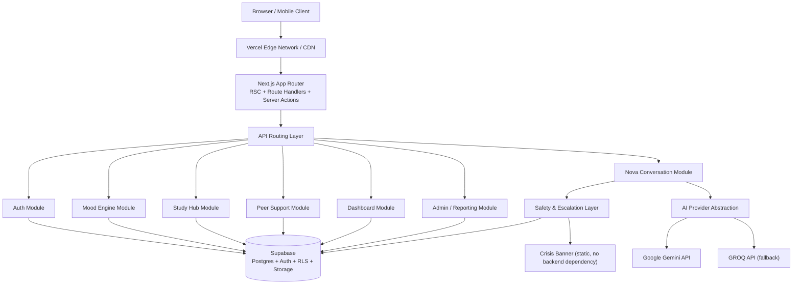
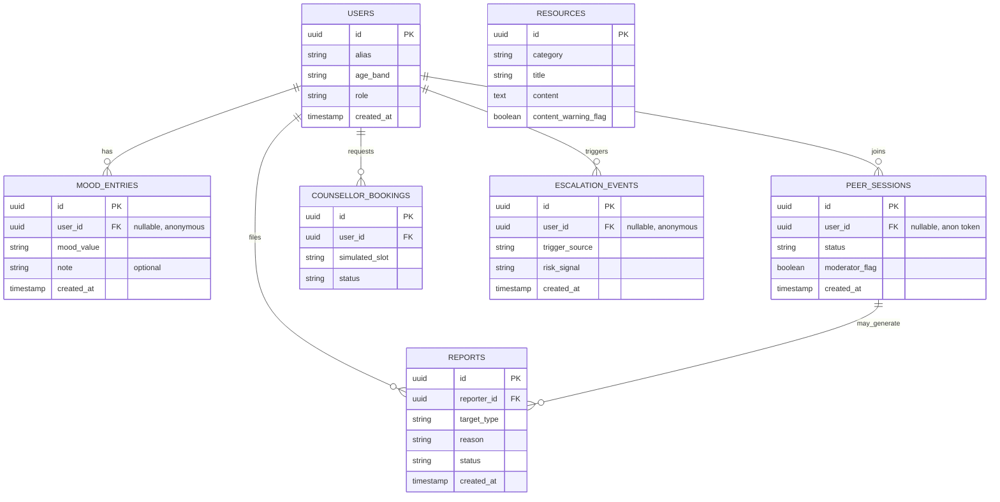
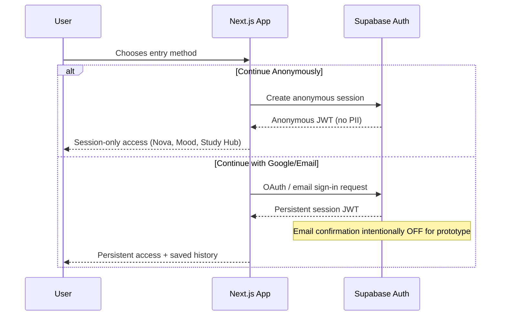
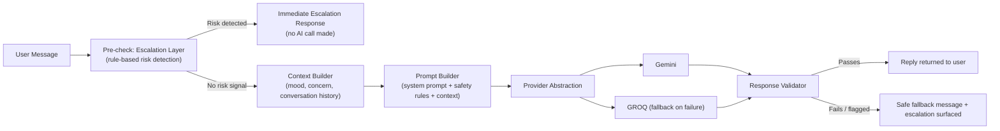
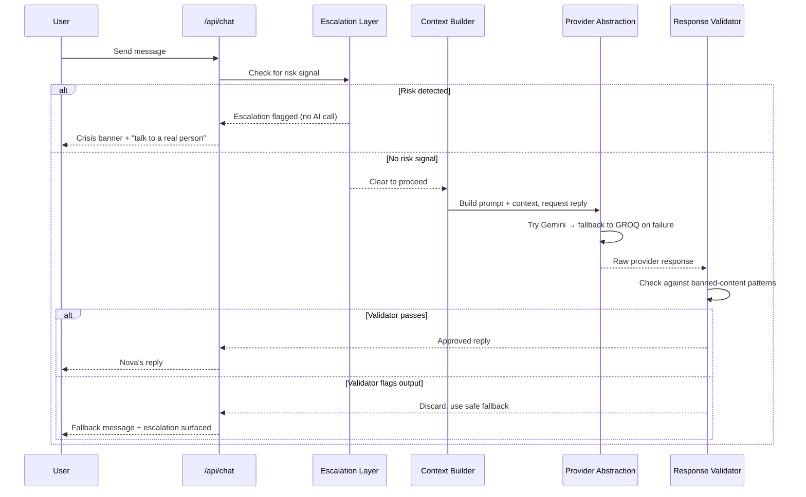
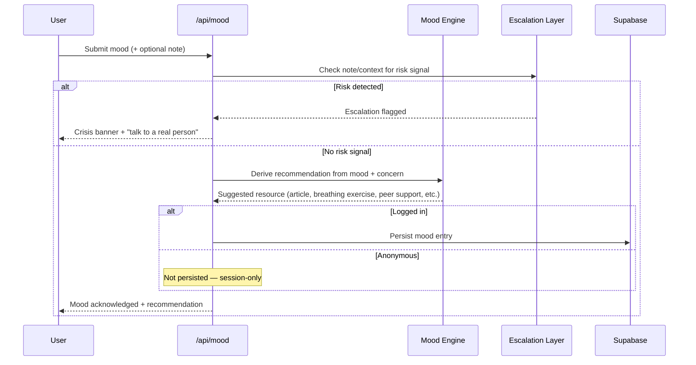
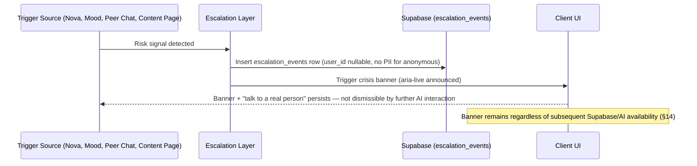

# Technical Requirements Document — TeensHelpline.org

**Version:** 1.0
**Status:** Draft — engineering companion to PRD.md v2 and the Client Requirement Document v2
**Scope:** This document describes HOW the system is engineered. It does not restate business goals, personas, marketing language, or UI copy — see PRD.md for product requirements and the Client Requirement Document for business context. Where a decision is product-facing, this TRD references the PRD section rather than duplicating it.

---

## 1. Technical Overview

TeensHelpline.org is an 8-day internship prototype built as a **modular monolith** on Next.js 16 (App Router) with Supabase as the sole backend service (database, auth, storage). The system is engineered to be safety-critical-first: the crisis escalation path and Nova's safety boundaries are architected as the highest-priority code paths in the system, ahead of visual polish or feature completeness. The codebase is designed for a 3-person team (1 dev lead, 1–2 UI/UX leads) to build in 8 days, while remaining structured enough to extend cleanly into a production system later without a rewrite.

## 2. Architecture

**Pattern:** Modular Monolith.

```
Next.js Frontend (RSC + Client Components)
        ↓
API Routing Layer (Route Handlers + Server Actions)
        ↓
Feature Modules (Auth, Nova, Mood Engine, Study Hub, Peer Support, Dashboard, Admin)
        ↓
Supabase (Postgres + Auth + Storage + RLS)
```

This is explicitly **not** microservices. A single deployable Next.js application on Vercel handles rendering, API routing, and orchestration; Supabase handles all persistence and auth. Each feature module is internally self-contained (its own service layer, types, and data-access functions) so that a module — most likely Nova/AI — can be extracted into a standalone service post-internship if load or team size grows. See §31 Future Migration Plan.

## Architecture Decision Records (ADR)

Short-form record of the decisions that shape this system, kept here rather than in separate files given the project's scale. New decisions of similar weight should be appended, not inserted retroactively.

| ID | Decision | Context | Consequences |
|---|---|---|---|
| ADR-001 | Modular Monolith, not microservices | 8-day build, 1 dev lead — service-per-feature would add deployment/ops overhead with no team to carry it | Single Vercel deployment; module boundaries (§6) keep a future extraction possible without a rewrite |
| ADR-002 | Supabase as the sole backend service | Need auth + Postgres + storage fast, without standing up separate infra | All persistence, RLS, and auth logic lives in one managed service; no separate API/DB server to operate |
| ADR-003 | Gemini primary, GROQ fallback, behind a Provider Abstraction | Single-provider AI risk (outage, rate-limit) is unacceptable for a safety-adjacent feature | Failover is a routing decision, not a rewrite; adding a third provider later touches only the abstraction layer |
| ADR-004 | Escalation Layer runs before any AI call, not after | Nova must be structurally incapable of engaging a crisis turn, not just instructed not to | Risk detection is rule-based and synchronous; the AI is simply never invoked when a risk signal fires |
| ADR-005 | Zustand for client state | App-scale doesn't justify Redux-style boilerplate; Context alone gets unwieldy across onboarding/mood/Nova UI state | Small, single-purpose stores (§20); no persistence middleware used, by design |
| ADR-006 | No `localStorage`/`sessionStorage` for any teen data | Anonymous users must leave no trace; logged-in users' data must stay RLS-protected, not browser-stored | All persistence for logged-in users goes through Supabase; anonymous state is memory-only and dies with the tab |
| ADR-007 | Email confirmation disabled in Supabase Auth for the prototype | No real domain/email deliverability exists yet; sign-up friction isn't worth it for an 8-day build | Documented, single-setting reversal at production stage (§9) |
| ADR-008 | Scoped exception for WebGL/Three.js in Onboarding | A game engine risks the Lighthouse budget, so Three.js/R3F is strictly confined to `features/onboarding/`, dynamically imported, code-split from the global bundle, with a graceful-degradation fallback (FPS probe/WebGL check). | Depth/tilt achieved via perspective elsewhere; literal 3D engine used exclusively for onboarding. This is a deliberate scope change, not an oversight. |
| ADR-009 | Fixed illustrated avatar set, no custom uploads, in MVP | Uploads would require Storage moderation and validation work the 8-day window doesn't have room for | Avatar selection is a card-picker over pre-set illustrations only |
| ADR-010 | AI Context Window capped at 6 messages | The TRD specifies a "bounded window of history" but doesn't define the limit | Both anonymous in-memory array and logged-in DB query are capped to the 6 most recent messages |
| ADR-011 | Escalation Logging Graceful Degradation | The PRD/TRD says "The violation is logged" but didn't specify error handling for the logging call itself | The log call is wrapped in a try/catch; if the DB is down, it logs to server console and returns the safe crisis response to the user. Safety takes precedence over telemetry |
| ADR-012 | Use `service_role` to write to `escalation_events` | The table has zero RLS policies for users to prevent exposure | Writing to this table uses the Admin Client (service_role key) to bypass RLS, ensuring it stays fully closed to client-side reads/writes |

## 3. Technology Stack

| Layer | Choice | Notes |
|---|---|---|
| Framework | Next.js 16 (App Router) | React Server Components by default; Client Components only where interactivity is required |
| Language | TypeScript (strict mode) | No `any`, no implicit any, strict null checks |
| Styling | Tailwind CSS | Utility-first, design tokens per design system |
| UI Components | shadcn/ui | Headless, composable, Tailwind-native — avoids a heavy component library dependency |
| Animated / Block Components | 21st.dev component blocks | Layered on top of shadcn/ui for pre-built animated blocks (cards, onboarding steps) |
| Animation | **Motion** (`motion` package — the current name for what was previously distributed as Framer Motion) | Page transitions, card selection, hover/tilt micro-interactions |
| Illustrated Animation | Lottie (`lottie-react`) | Nova's illustrated moments, mood-selection characters, onboarding welcome sequence |
| "3D-like" Depth | CSS 3D transforms (`perspective`, `transform-style: preserve-3d`) driven by Motion's `whileHover`/`whileTap` | Gives depth/parallax/tilt without a WebGL engine — see callout below |
| State Management | Zustand | Lightweight, no boilerplate, fits the app's scale (onboarding, mood, Nova UI state) |
| Forms & Validation | React Hook Form + Zod | Shared schemas between client and server |
| Database | Supabase PostgreSQL | Managed Postgres with Row Level Security |
| Auth | Supabase Auth | Anonymous sessions + Google/Email persistent accounts |
| Hosting | Vercel | Edge network, preview deployments per PR |
| AI (Primary) | Google Gemini API (AI Studio) | Conversation generation for Nova |
| AI (Secondary/Fallback) | GROQ API | Fast, low-latency fallback on Gemini failure/rate-limit |
| Testing | Vitest (unit/integration), Playwright (E2E) | See §29 Testing Strategy |

> **Callout — "3D-like vibe" without a game engine:** Full WebGL (Three.js / React Three Fiber) is deliberately **out of scope for the 8-day MVP**. A game engine adds a build-complexity and performance-budget risk (Lighthouse > 90, < 3s mobile load) that isn't worth it for onboarding polish. CSS `perspective` + Motion's spring-based hover/tilt transforms deliver a convincing depth effect at a fraction of the bundle cost. If the UI/UX lead wants a literal 3D scene (e.g. a hero illustration), flag it explicitly — it would be scoped as a Phase 2 enhancement layer, not baseline architecture.

---

## AI-Assisted Development Standards

This project is built using AI-assisted development. The following MCP servers are **development tools only** — they are never runtime dependencies of the shipped application and must not appear in production `package.json` dependencies (dev-only tooling, IDE/agent config).

| MCP Server | Purpose | Rule |
|---|---|---|
| **Context7 MCP** | Fetches latest, version-accurate package documentation | Always consult before implementing a new library or an unfamiliar API from an existing one — do not rely on training-data knowledge of library APIs, which may be stale |
| **Supabase MCP** | Database schema, auth config, storage, migrations | Always use Supabase MCP for schema changes and migrations instead of hand-written SQL run manually, whenever practical |
| **GitHub MCP** | Repository management, PRs, issues | Used for team collaboration workflows described in §37–38 |
| **Playwright MCP** | Browser automation for testing | Preferred E2E framework — see §29 |

Development workflow rules:
- **Architecture decisions:** consult Context7 before adopting or upgrading any library.
- **Database changes:** use Supabase MCP rather than manual SQL console edits, so schema changes stay tracked and reproducible.
- **UI work:** follow the established design-system tokens (see PRD's Product Philosophy and design-system context doc) rather than ad hoc styling.
- **Testing:** Playwright is the standard for the safety-critical E2E suite defined in §29.

---

## 4. System Architecture Diagram



## 5. Folder Structure

```
/
├── app/                        # Next.js App Router — routes only, thin
│   ├── (public)/                # Home, About, Safety, FAQ, Contact, policies
│   ├── (auth)/                  # Auth entry screens (anonymous/Google/Email)
│   ├── onboarding/               # Interactive onboarding flow
│   ├── dashboard/
│   │   ├── teen/
│   │   └── parent/
│   ├── study-hub/
│   ├── peer-support/
│   ├── parents/
│   ├── schools/
│   └── api/                     # Route Handlers (thin — delegate to services/)
│       ├── auth/
│       ├── chat/                # Nova
│       ├── mood/
│       ├── resources/
│       ├── peer-support/
│       ├── dashboard/
│       ├── admin/
│       └── analytics/
│
├── features/                    # Feature-first modules (see §6)
│   ├── auth/
│   ├── nova/
│   ├── mood-engine/
│   ├── study-hub/
│   ├── peer-support/
│   ├── dashboard/
│   └── admin/
│
├── components/                  # Shared/shadcn/21st.dev UI primitives only
│   └── ui/
├── hooks/                       # Shared React hooks (non-feature-specific)
├── lib/                         # Cross-cutting utilities (supabase client, env, logger)
├── services/                    # Cross-feature service abstractions (AI provider abstraction, rate limiter)
├── stores/                      # Zustand stores (onboarding, mood, nova UI, ui/quick-exit)
├── types/                       # Shared TypeScript types/interfaces
├── utils/                       # Pure helper functions
├── public/                      # Static assets, Lottie JSON files, illustrations
├── styles/                      # Tailwind config extensions, globals.css
├── tests/
│   ├── unit/
│   ├── integration/
│   └── e2e/                      # Playwright — safety-critical flows
└── supabase/                    # Migrations, RLS policies, seed data (managed via Supabase MCP)
```

**Rule:** `app/` stays thin (routing + composition only). All real logic lives in `features/<module>/` behind a service layer, so route handlers and Server Actions are simple call-throughs — this is what keeps the modular monolith extractable later.

## 6. Module Architecture

Each feature module follows the same internal shape: `service.ts` (business logic), `data.ts` (Supabase access), `schema.ts` (Zod validation), `types.ts`.

| Module | Responsibility | Notes |
|---|---|---|
| **Auth** | Anonymous session creation, Google/Email sign-in, session/role resolution | Wraps Supabase Auth; anonymous sessions never persist to a `users` row with PII |
| **Nova** | Conversation orchestration | See §17 AI Architecture for full internal breakdown (Conversation Service, Prompt Builder, Context Builder, Safety Layer, Escalation Layer, Response Validator, Provider Abstraction) |
| **Mood Engine** | Captures mood input, derives a recommendation | Consumes Nova's Context Builder output; on high-risk signal, calls the Safety/Escalation Layer directly, bypassing recommendation logic entirely |
| **Study Hub** | Content retrieval, search, Nova-driven surfacing | Statically generated content where possible (see §18 Caching) |
| **Resources** | General safety/safeguarding/policy content | Static, no auth required |
| **Peer Support** | Session creation, moderation flag handling, report routing | All messages pass through a moderation/report hook before persistence |
| **Dashboard** | Teen/Parent dashboard data aggregation | Read-side composition of Auth + Mood + Study Hub + Peer Support summaries |
| **Analytics** | Phase 2 aggregate stats only | Not built in MVP; module folder scaffolded but empty by design |
| **API Layer** | Thin Route Handlers / Server Actions | Validates input via Zod, calls the relevant module's service, standard response envelope (§13) |
| **Admin** | Reporting/escalation-log views | Coming Soon per PRD — module scaffolded, UI gated behind role check, no dashboard routes exposed in MVP nav |

## Dependency Rules

Extends the folder-structure rule already stated in §5. These are the allowed import directions — violating them is a code-review blocker, not a style preference:

- `app/` may import from `features/`, `components/`, `lib/`, `hooks/`, `stores/`, `types/`, `utils/`. Nothing may import from `app/`.
- `features/<A>/` must never import directly from `features/<B>/`'s internals (its `service.ts`/`data.ts`). If module A genuinely needs module B's data, it goes through B's exported public interface only — this is what keeps modules extractable per ADR-001.
- `components/ui/` (shadcn/ui primitives and 21st.dev blocks) must stay dependency-free of `features/` — a primitive button or card never imports feature logic, only props.
- `services/` (cross-cutting abstractions like the AI Provider Abstraction, rate limiter) may be used by any `features/`, but must never import from a specific feature — a service that only Nova uses still belongs inside `features/nova/`, not `services/`.
- `stores/` (Zustand) may be imported by `features/` and `app/`, but a store must never call Supabase directly — persistence for logged-in users goes through the owning feature's service layer, keeping ADR-006 enforceable in one place.
- `lib/` (Supabase client, env validation, logger) has no dependencies on `features/` or `stores/` — it sits below everything.

## Component & Design System Architecture

Three layers, thinnest to richest:

1. **Design tokens** — Tailwind config (color, spacing, type scale, motion durations/easing) is the single source of truth for visual constants; components never hardcode a color or spacing value that has a token equivalent.
2. **Primitives** — shadcn/ui components in `components/ui/`, used as-is or lightly themed via tokens. These carry no feature knowledge and no Motion/Lottie dependency of their own.
3. **Blocks and feature components** — 21st.dev blocks and any Motion/Lottie-driven composition (onboarding cards, mood picker, Nova's illustrated welcome) live inside the relevant `features/<name>/components/` folder, not in the shared `components/` tree, since they're feature-specific rather than reusable primitives.

Rule of thumb for animation choice: plain Tailwind transitions for simple hover/focus states; Motion for anything with sequencing, gestures, or spring physics (page transitions, card selection, the 3D-hover tilt from ADR-008); Lottie only for pre-authored illustrated animation, never as a substitute for a Motion-driven UI interaction.

---

## 7. Database Architecture

Tables (derived from the Client Requirement Document's data model, described architecturally — no SQL):

| Table | Purpose | Key Relationships |
|---|---|---|
| `users` | Alias, age-band, persona/preferences, role, auth state | 1:many → mood_entries, peer_sessions, counsellor_bookings |
| `mood_entries` | Single-session (MVP) mood capture, optional note | many:1 → users (nullable for anonymous sessions, which are never persisted) |
| `peer_sessions` | Peer-support session records, moderation flag, status | many:1 → users (or anon token) |
| `counsellor_bookings` *(simulated)* | Simulated booking slot/status | many:1 → users |
| `reports` | User-submitted reports (peer sessions or content) | many:1 → users (reporter), polymorphic `target_type` reference |
| `resources` | Study Hub / resource content | Standalone, content-managed |
| `escalation_events` | Logged whenever the crisis banner is triggered | many:1 → users (nullable — anonymous escalations are logged without PII, session-scoped only) |

### Entity Relationship Diagram



`resources` is intentionally left without a foreign-key relationship in the diagram — it's referenced by category/id from application logic (Study Hub, Nova recommendations) rather than a hard DB relationship, since recommendation logic is expected to evolve quickly.

## 8. Database Design Philosophy

- **RLS-first:** every table has Row Level Security enabled from creation; no table is ever queried with the service-role key from client-reachable code.
- **Anonymous-safe by design:** anonymous sessions are never written to `users` with identifying data; anonymous mood/chat state lives only in-memory/Zustand for the browser session and is never persisted server-side, per PRD's Chat Memory table.
- **Alias over identity:** no table stores a real name; `users.alias` is the only display identifier.
- **Append-only where it matters:** `escalation_events` and `reports` are insert-only from the application layer — no update/delete path in MVP, preserving an audit trail.
- **Simulated tables marked in schema comments:** `counsellor_bookings` and any credential/organisation tables carry an explicit `-- PROTOTYPE: simulated, not connected to a real backend` comment at the migration level, so future engineers don't mistake them for production-ready.

## 9. Authentication Flow



> **Prototype decision — email confirmation disabled:** Supabase Auth's email confirmation is intentionally turned off for the 8-day build to remove sign-up friction while there is no real domain/email deliverability set up. This is a single Supabase project setting; re-enabling it for production requires toggling that setting and does not require a code change. This decision is documented, not an oversight.

## 10. Authorization (RBAC)

Technical enforcement of the roles defined in PRD.md's User Permissions table, implemented as Supabase RLS policies keyed off `auth.uid()` and a `users.role` column, plus route-level guards in Next.js middleware for role-gated pages (Coming Soon dashboards return a "not yet available" state rather than a 404, per PRD's honesty-about-scope principle).

| Role | Enforcement Point |
|---|---|
| Guest / Anonymous | No `users` row; RLS policies scoped to session-only tables (mood_entries with null user_id) |
| Teen | RLS policies scope all reads/writes to `auth.uid() = user_id` |
| Parent | RLS restricts to read-only guidance content; no query path to any teen's `user_id`-scoped data exists |
| Counsellor / Teacher-Educator / Admin *(Coming Soon)* | Role column exists in schema now; RLS policies and route guards for these roles are written but their dashboards are not linked in navigation until Phase 2 |

## 11. API Design Standards

- All API routes live under `/api/*` as Route Handlers; mutations from within pages prefer **Server Actions** over client-side `fetch` calls where the interaction is a same-origin form submission.
- Every request is validated against a Zod schema before touching a service function — no unchecked `req.json()` reaches business logic.
- Response envelope is consistent across all endpoints (§13).
- Versioning: not needed for an 8-day single-client prototype; endpoints are unversioned (`/api/mood`, not `/api/v1/mood`). A versioning strategy is deferred to §31 Future Migration Plan.

## 12. REST Endpoint Structure

| Endpoint | Purpose | Auth | Rate Limit |
|---|---|---|---|
| `/api/auth/*` | Session creation, role selection | Public (anonymous) / Supabase session | Auth-specific limit, see §"Rate Limiting" |
| `/api/chat` | Nova conversation turn | Anonymous or logged-in session | Strict per-session AI limit |
| `/api/mood` | Mood check-in submission + recommendation | Anonymous or logged-in session | Per-user/session limit |
| `/api/resources` | Study Hub content + search | Public | Standard |
| `/api/peer-support/*` | Peer session, messaging, report (`/api/peer-support/report`) | Anonymous or logged-in session | Standard |
| `/api/dashboard` | Teen/Parent dashboard data | Authenticated | Standard |
| `/api/admin` | Reporting/escalation views *(Coming Soon)* | Admin role only | Standard, internal-only |
| `/api/analytics` | Aggregate stats *(Phase 2, not built in MVP)* | Admin role only | N/A in MVP |

### Endpoint detail — `/api/chat` (representative example)

| Aspect | Detail |
|---|---|
| Purpose | Send a user message to Nova, receive a validated response |
| Authentication | Anonymous session token or persistent session JWT |
| Input | `{ message: string, conversationId?: string, moodContext?: MoodContext }` — Zod-validated |
| Output | `{ reply: string, escalation: boolean, escalationReason?: string }` |
| Errors | `400` invalid input, `429` rate limited, `503` all AI providers unavailable (fallback message returned instead of hard error where possible) |
| Rate Limit | Strictest limit in the system — see §"Rate Limiting" |

*(Remaining endpoints follow the same documentation shape in the actual API reference doc; omitted here for brevity to avoid duplicating what belongs in `docs/api/`.)*

## 13. Request/Response Standards

```
Success:
{
  "success": true,
  "data": { ... }
}

Error:
{
  "success": false,
  "error": {
    "code": "STRING_ERROR_CODE",
    "message": "Human-readable message"
  }
}
```

- All timestamps: ISO 8601, UTC.
- All IDs: UUID v4.
- No endpoint ever returns raw Supabase/Postgres error objects to the client.

## 14. Error Handling

- Centralized error-handling utility wraps every Route Handler/Server Action; unhandled exceptions are caught, logged (§15), and converted to the standard error envelope.
- Per PRD's Edge Cases and Error Handling sections: the crisis banner is a static component with **no data dependency** — it must render correctly even when every backend service (Supabase, Gemini, GROQ) is down.
- AI-specific errors (timeout, rate-limit, malformed response) never bubble up as raw errors to the user — they resolve to Nova's documented fallback message (§17).

## 15. Logging Strategy

- Structured JSON logging (not free-text) for all server-side logs, using a shared `logger` utility in `lib/`.
- **Escalation events are logged distinctly and durably** — every crisis-banner trigger writes an `escalation_events` row, independent of general application logs, since this is the one audit trail that must never be lost.
- No chat content or mood notes are ever written to general application logs (only to their RLS-protected tables) — logs must not become an unintended PII leak vector.
- Log levels: `error`, `warn`, `info`, `debug` (debug disabled in production builds).

## 16. Security

| Concern | Approach |
|---|---|
| **Rate limiting** | Per-IP and per-user/session limits via a shared rate-limiter service (in-memory/Upstash-style token bucket, acceptable for prototype scale); AI endpoints (`/api/chat`) get the strictest limits; auth endpoints get abuse-prevention limits (login attempt throttling) |
| **Input validation** | Zod schemas on every endpoint; no request reaches a service function unvalidated |
| **Sanitization** | All user-generated text (peer support messages, mood notes, reports) sanitized before storage and before render (no raw HTML rendering of user content) |
| **SQL injection prevention** | No raw SQL from client-reachable code paths; all queries go through the Supabase client/query builder, which parameterizes inputs |
| **Secrets management** | All keys (Supabase service role, Gemini, GROQ) live in Vercel environment variables, never in client bundles; `.env.example` documents required vars with no real values |
| **CORS** | API routes restricted to the app's own origin; no open CORS policy |
| **Security headers** | CSP, `X-Frame-Options`, `X-Content-Type-Options`, `Referrer-Policy` set via Next.js middleware/`next.config` headers |
| **CSRF** | Server Actions carry Next.js's built-in CSRF protections; Route Handlers used for mutation rely on same-origin + SameSite cookies |
| **XSS prevention** | React's default escaping; no `dangerouslySetInnerHTML` for user-generated content; strict CSP as a second layer |
| **Prompt injection mitigation** | User messages are never concatenated directly into the system prompt as instructions — they're passed as clearly delimited "user content" in the message array; the system prompt explicitly instructs the model to ignore any user attempt to override its role or safety rules |
| **AI output validation** | Every Nova response passes through the Response Validator (§17) before reaching the user — checked against banned-content patterns (diagnosis language, medication references, crisis-handling attempts) before being returned |
| **Secure cookies** | Supabase session cookies set `HttpOnly`, `Secure`, `SameSite=Lax` — never readable from client-side JavaScript |
| **Dependency scanning** | Dependabot (or `npm audit` at minimum) enabled on the repository so known-vulnerable packages surface automatically, without standing up a dedicated security-tooling pipeline |

## 17. AI Architecture

**Provider roles:**
- **Gemini (primary):** handles all standard Nova conversation turns — general-purpose reasoning, tone consistency, broader context window.
- **GROQ (secondary/fallback):** invoked automatically when Gemini errors, times out, or is rate-limited — prioritizes low latency to avoid the user hitting a dead end.

**Why a Provider Abstraction Layer exists:** Nova's conversation service never calls Gemini or GROQ SDKs directly. It calls a common `AIProvider` interface (`generateReply(context): Promise<ProviderResponse>`), implemented separately by `GeminiProvider` and `GroqProvider` (and a scaffolded, unimplemented `OpenAIProvider` for future use). This means: (1) failover between providers is a routing decision, not a rewrite, (2) a future provider swap or addition doesn't touch conversation logic, safety logic, or escalation logic at all.

**Nova internal pipeline:**



- **Escalation Layer runs first, before any AI call is made** — this is deliberate. Rule-based risk detection (keyword/pattern matching on self-harm, suicidal ideation, substance-use language) happens synchronously and, if triggered, the AI is never invoked for that turn; the crisis banner and escalation prompt are returned directly. This guarantees Nova structurally cannot "talk through" a crisis, matching the PRD's hard rule. To check the mood context for risk signals, the mood note is concatenated directly onto the message string before running it through the Escalation Layer regex.
- **System prompt** encodes Nova's persona (elder-sibling tone), its supported topic scope, and explicit hard constraints (never diagnose, never reference medication, never claim to replace a therapist, never attempt to manage a detected crisis — which shouldn't reach it anyway due to the pre-check).
- **Context retrieval** pulls the user's stated mood and "what brought you here" concern (from onboarding, if available) plus recent conversation turns (for logged-in users) or in-memory session turns (anonymous) — never a full chat history dump beyond a bounded window (capped at **6 messages**).
- **Response Validator** re-checks the *model's own output* (not just the user's input) against the same banned-content patterns, since a model can drift into disallowed territory even with a good system prompt — this is a second, independent safety gate.
- **Fallback handling:** Gemini failure → automatic retry once → failover to GROQ → if both fail, a static, pre-written supportive fallback message is returned along with a link to Study Hub and the ever-present crisis banner. Never a silent failure or raw error shown to the user, per PRD's Error Handling table.

### Sequence — Nova Conversation Request



### Sequence — Mood Check-in Flow



### Sequence — Crisis Escalation Flow



## 18. Caching Strategy

- Study Hub / Resources content: statically generated (SSG) or ISR where content changes infrequently — fast, cache-friendly, no auth dependency.
- Nova responses: **never cached** — each reply must reflect current safety-checked state; caching an AI response risks staleness in a safety-critical context.
- Public marketing/informational pages (Home, About, Safety, FAQ): edge-cached via Vercel's CDN.
- Supabase query caching: minimal at prototype scale; not a priority for 8 days.

## 19. Performance Strategy

- React Server Components by default; Client Components (`'use client'`) only where interactivity is required (onboarding motion, Nova chat UI, mood picker).
- Motion/Lottie bundles are code-split and loaded only on the onboarding/Nova routes that need them — not in the global bundle.
- `next/image` for all imagery; illustrated assets optimized/compressed.
- Target: Lighthouse > 90 (performance, accessibility, best practices), < 3s average mobile load — matches PRD Success Metrics; these are enforced in CI (see §23) as a build-blocking check where feasible within the 8-day window, otherwise a manual pre-deployment audit.
- Fonts loaded via `next/font` (self-hosted, no render-blocking third-party font requests) to protect the mobile load-time budget.
- Bundle size spot-checked before each milestone (`next build` output) specifically for the onboarding/Nova routes, since Motion + Lottie are the largest client-side additions in this stack.

## 20. State Management

Zustand stores, kept small and single-purpose:

| Store | Holds | Persistence |
|---|---|---|
| `onboarding-store` | Current step, optional avatar choice, selected role, mood-at-onboarding, stated concern | In-memory only; not written to browser storage (privacy — see PRD Chat Memory) |
| `moodStore` | Current session's mood entry + optional note | In-memory for anonymous; synced to Supabase only for logged-in users |
| `novaStore` | Transient conversation UI state (typing indicator, current escalation flag) | In-memory only |
| `uiStore` | Quick-exit state, modal/dialog visibility | In-memory only |

> **No `localStorage`/`sessionStorage` for any teen-identifying or conversation data**, anonymous or logged-in — this would create a persistence path the PRD explicitly says shouldn't exist for anonymous users, and would put PII in a less-secured storage layer for logged-in users. Logged-in persistence goes through Supabase (RLS-protected), never the browser's storage APIs.

## 21. Environment Variables

| Variable | Scope | Notes |
|---|---|---|
| `NEXT_PUBLIC_SUPABASE_URL` | Client + Server | Public Supabase project URL |
| `NEXT_PUBLIC_SUPABASE_ANON_KEY` | Client + Server | Public anon key, RLS-protected |
| `SUPABASE_SERVICE_ROLE_KEY` | Server only | Never exposed to client bundle; used only in trusted server contexts |
| `GEMINI_API_KEY` | Server only | Primary AI provider |
| `GROQ_API_KEY` | Server only | Fallback AI provider |
| `NODE_ENV` | Both | `development` / `production` |

- Env vars validated at boot via a Zod-based schema (fail fast with a clear error if a required var is missing, rather than failing obscurely at runtime).
- `.env.example` documents every variable with placeholder values, never real secrets.

## Configuration Management

Distinct from environment variables (§21), which cover secrets/connection strings. Configuration here means the smaller set of decisions that vary by context but aren't secret:

- **Role/feature gating:** Coming Soon roles (Counsellor, Teacher/Educator, Admin) are gated by a simple config map (`role → isEnabled`) checked at the route/middleware level — not a full feature-flag service, which would be over-engineering for three toggles.
- **Design tokens:** live in `tailwind.config` as the single source of truth (§"Component & Design System Architecture") — not duplicated into component-level constants.
- **MCP configuration:** `.agents/mcp/servers.example.json` documents Context7, Supabase, GitHub, and Playwright MCP server config for development use only; this file is never read by the deployed application and carries no production secrets.
- **Per-environment values:** anything that differs between preview/staging/production (Supabase project ref, AI provider keys) is set in Vercel's environment-scoped variables, not in a checked-in config file.

## 22. Deployment Pipeline

- Vercel project connected to the GitHub repository.
- Every PR gets an automatic Vercel Preview Deployment.
- Merges to `develop` deploy to a staging environment; merges to `main` (via `release`) deploy to production, per the Git Workflow in §37.
- Environment variables configured per-environment in the Vercel dashboard (preview/staging/production), sourced from Supabase MCP-managed project settings for anything database-related.

## 23. CI/CD Recommendations

GitHub Actions pipeline, triggered on PR:
1. Install dependencies
2. Lint (ESLint, strict config)
3. Typecheck (`tsc --noEmit`, strict mode)
4. Unit + integration tests (Vitest)
5. Safety-critical Playwright E2E suite (§29)
6. Production build check
7. Block merge on any failure

## 24. Monitoring

- Vercel's built-in logs/analytics for request-level monitoring.
- Supabase's built-in logs for database/auth activity.
- `escalation_events` table itself doubles as the primary safety-monitoring signal — any spike or anomaly here is the highest-priority thing to review.
- Sentry or an equivalent error tracker is a reasonable Phase 2 addition; not required for the 8-day MVP given team size.

## 25. Analytics

Not built in MVP, per PRD scope. Phase 2 analytics must be aggregate-only, privacy-respecting: no individual chat content, no session replay, no third-party ad-tracking pixels — enforced at the architecture level by never wiring a third-party analytics SDK into any teen-facing page in this build.

## 26. Accessibility Requirements

- WCAG AA as a build-blocking target, not aspirational — verified via automated tooling (axe/Lighthouse) plus manual keyboard-navigation and screen-reader spot checks.
- The crisis banner specifically must be screen-reader announced (`aria-live`) whenever it triggers dynamically, not just visually present.
- Focus states, contrast ratios, and touch-target sizes are design-system tokens, not per-component decisions.

## 27. Internationalization Readiness

- English is the only shipped language in MVP; Hindi is Phase 2 per PRD.
- To avoid a rewrite later, user-facing strings are kept out of deeply nested component logic where practical (colocated in per-feature copy objects), but a full i18n library (e.g. `next-intl`) is **not** installed in the 8-day build — that would be premature given the timeline. This is a known constraint, not an oversight (§32).

## 28. Storage Strategy

- No user file uploads in MVP (avatar selection is from a fixed illustrated set, not custom uploads, per PRD's open question resolved toward the simpler option given the timeline).
- Supabase Storage is used only for static application assets (Lottie JSON files, illustration sets) served via CDN — not for user-generated or user-uploaded data.

## 29. Testing Strategy

Given the 8-day window, testing depth is deliberately triaged: **exhaustive coverage on safety-critical paths, lighter coverage elsewhere.**

| Layer | Tool | Coverage |
|---|---|---|
| Unit | Vitest | Prompt Builder, Response Validator, Escalation Layer pattern-matching, Zod schemas, utils |
| Integration | Vitest + Supabase local/test project | API route handlers against a real (test) Supabase instance, RLS policy checks |
| **E2E (safety-critical, required)** | Playwright | Crisis banner renders on every page including simulated backend outage; quick-exit works from every route; Nova risk-signal test scenarios (self-harm, suicidal ideation, substance-use language) reliably trigger escalation and never produce a crisis-handling AI response |
| E2E (everything else) | Manual QA | Onboarding flow, mood check-in, Study Hub browsing, peer support UI, dashboards — manually verified against Definition of Done rather than automated, given the timeline |
| AI testing | Scripted prompt-injection and boundary test set | A fixed set of adversarial prompts (attempts to get Nova to diagnose, prescribe, or handle a crisis) run against the Response Validator before each deploy |
| Security testing | Manual review + automated dependency scanning | RLS policy review per table; `npm audit`/Dependabot for dependency vulnerabilities |

## 30. Scalability Strategy

- Stateless Route Handlers scale horizontally on Vercel without any code change.
- Supabase can scale vertically (compute tier) or add read replicas later without an application-layer rewrite.
- The modular monolith's clean module boundaries (§6) mean the Nova/AI module specifically — the most likely bottleneck under real load — can be extracted into its own service later (see §31) without touching Auth, Mood, or Study Hub modules.

## 31. Future Migration Plan

- **Nova/AI module → standalone service:** if conversation volume grows post-internship, extract the Provider Abstraction + Safety/Escalation Layer into a dedicated service behind the same interface, with the Next.js app calling it over HTTP instead of an in-process function call.
- **Auth hardening:** re-enable Supabase email confirmation (single setting toggle) once a real domain and email deliverability exist.
- **Counsellor Booking:** replace the simulated booking tables/flow with a real scheduling backend and real guardian-consent legal workflow.
- **API versioning:** introduce `/api/v1/*` prefixing if/when external consumers of the API appear.
- **i18n:** introduce `next-intl` (or equivalent) once Hindi localization is prioritized.

## 32. Known Technical Constraints

- 8-day build window, single dev lead — no dedicated backend/security/QA engineer.
- Gemini and GROQ free/prototype-tier rate limits may throttle testing volume.
- No real integration to actual crisis helpline numbers — they are displayed, not dialed programmatically, per Client Requirement Document.
- No native mobile apps — responsive web only.
- No full i18n implementation in MVP.

## 33. Technical Risks

| Risk | Mitigation |
|---|---|
| AI provider outage or rate-limit mid-demo | GROQ automatic fallback; static supportive fallback message as last resort |
| Prompt injection attempting to bypass Nova's safety rules | Escalation Layer runs before any AI call; Response Validator re-checks model output independently of the system prompt |
| Animation/motion polish (Motion, Lottie, 3D-hover effects) eating into the 8-day timeline at the expense of safety-critical work | Definition of Done (§39) and Feature Prioritization (PRD MoSCoW) treat crisis escalation, Nova safety, and quick-exit as Must-Have and gate everything else behind them |
| RLS misconfiguration exposing teen data | Every table's RLS policy is reviewed against the RBAC table (§10) before deploy; integration tests assert access is denied for out-of-scope roles |
| Anonymous session data leaking via browser storage | Explicit architectural rule (§20): no `localStorage`/`sessionStorage` for any teen data, anonymous or logged-in |

---

## 34. Development Guidelines

- TypeScript everywhere; no `.js` files in `app/`, `features/`, `lib/`, `services/`.
- Server Components by default; a component only becomes a Client Component when it needs state, effects, or browser APIs.
- Absolute imports (`@/features/...`, `@/components/...`) — no deep relative `../../../` chains.
- Feature-based architecture: a feature's logic, types, and data access stay inside its `features/<name>/` folder; cross-feature imports go through a clearly exported public interface, not deep imports into another feature's internals.

## 35. Coding Standards

- Strict ESLint config (no unused vars, no implicit any, exhaustive-deps for hooks).
- Strict TypeScript (`strict: true`, `noUncheckedIndexedAccess: true`).
- Zod schemas colocated with the endpoint/service they validate, exported for reuse on both client (React Hook Form) and server (Route Handler) sides.
- Error handling: never swallow an error silently; every catch block either logs (with context) or rethrows a typed application error.
- Comments explain *why*, not *what* — the code should already say what it does.

## 36. Naming Conventions

- Files: `kebab-case.ts` / `kebab-case.tsx`.
- Components: `PascalCase`.
- Functions/variables: `camelCase`.
- Zustand stores: `useXStore` (e.g. `useOnboardingStore`).
- Zod schemas: `xSchema` (e.g. `moodEntrySchema`).
- Route Handlers: match the REST resource name (`/api/mood/route.ts`).

## 37. Git Workflow

```
main
   ↓
develop
   ↓
feature/*
   ↓
Pull Request
   ↓
develop
   ↓
release
   ↓
main
```

Never commit directly to `main`. Never commit directly to `develop`. Kept lightweight for a 3-person/8-day sprint — no multi-stage approval chains, but the PR-before-merge rule is non-negotiable, especially for anything touching Auth, Nova's safety layer, or RLS policies.

## 38. Branch Strategy

- `feature/<short-description>` branches off `develop`.
- One feature branch per module/task where practical (e.g. `feature/nova-escalation-layer`, `feature/onboarding-motion`).
- `release` branch cut from `develop` before a submission milestone; only bugfixes land on `release`.

## 39. Definition of Done (Technical)

Every feature must satisfy all of the following before being considered complete:

- TypeScript build passes with zero errors (`tsc --noEmit`)
- ESLint passes with zero errors
- Zod validation in place for every input surface it touches
- RLS policy reviewed and matches the RBAC table (§10) for any new table/column
- Safety-critical E2E suite still passes (if the change touches Nova, escalation, or crisis banner rendering)
- Loading, empty, and error states implemented
- Responsive across mobile/tablet/desktop
- Accessible (WCAG AA spot-checked)
- No secrets or PII logged (§15)
- Documented: behaviour and known limitations noted in the relevant `docs/` file

## 40. Technical Checklist

- [ ] Supabase project provisioned via Supabase MCP; RLS enabled on every table from creation
- [ ] Env vars validated at boot; `.env.example` complete and accurate
- [ ] Escalation Layer verified to run before any AI provider call, with test coverage
- [ ] Response Validator test suite (adversarial prompts) passing
- [ ] GROQ fallback path manually verified (simulate Gemini failure)
- [ ] Crisis banner verified to render under simulated Supabase/AI outage
- [ ] Quick-exit verified functional on every route
- [ ] Lighthouse performance + accessibility both > 90 on core pages
- [ ] CI pipeline green on `develop` before cutting `release`
- [ ] No `localStorage`/`sessionStorage` usage for teen-identifying or conversation data anywhere in the codebase
